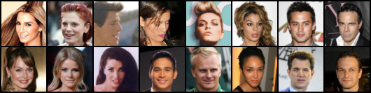
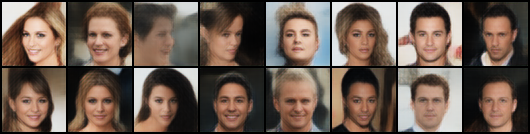

# Deep Feature Consistent Variational Autoencoder

Reproduction of the results of [this paper](http://ieeexplore.ieee.org/document/7926714/) on 'Deep Feature Consistent Variational Autoencoders' in PyTorch.

*Input images*

*Reconstruced images using content loss from VGG layers relu1_1, relu2_1, relu3_1*

---

[arxiv](https://arxiv.org/abs/1610.00291)